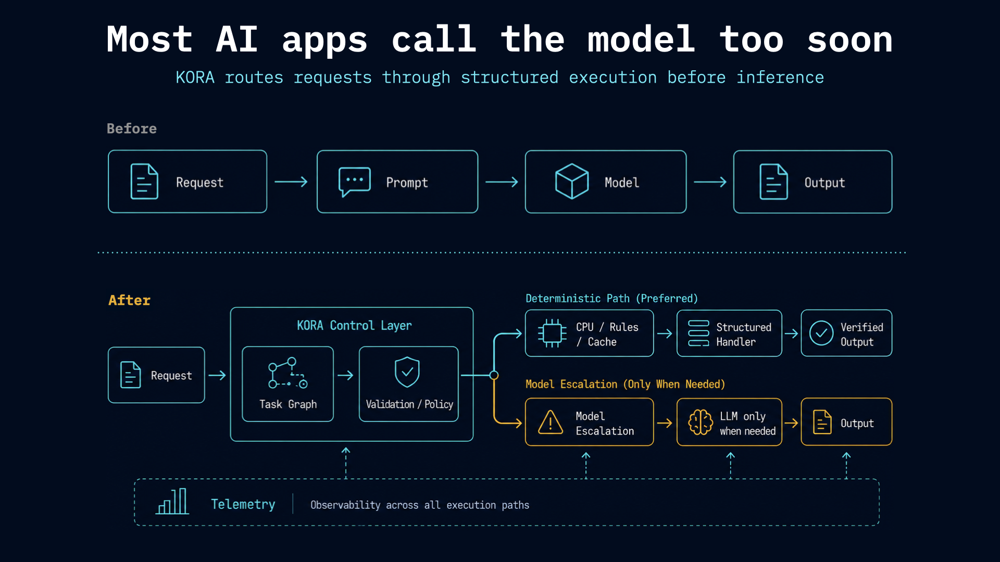
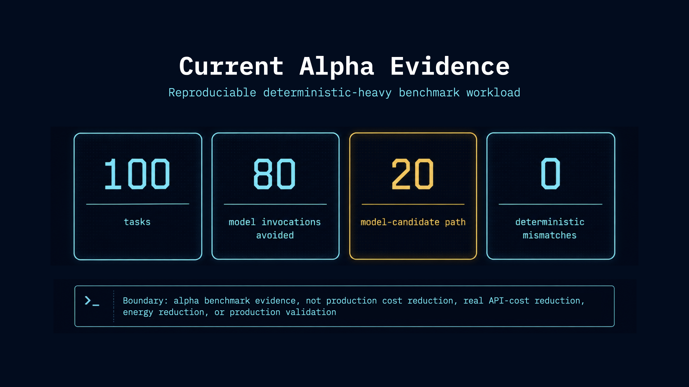
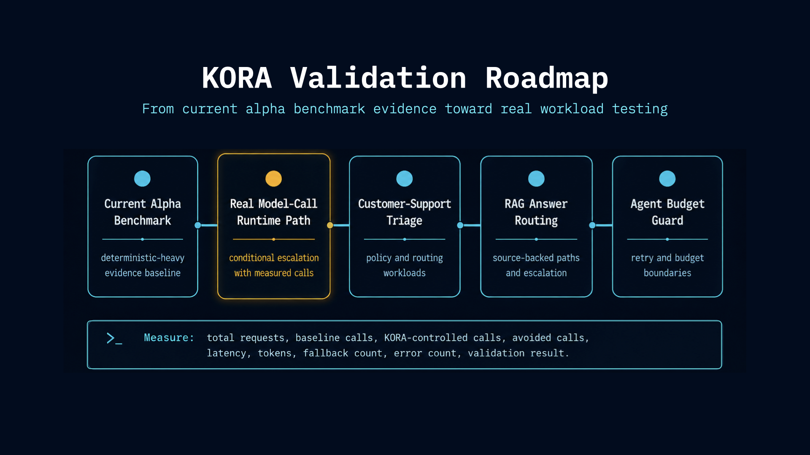
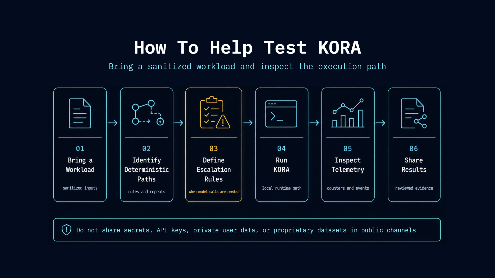

# KORA

Open-source execution control for AI workloads.

Most AI apps call the model too soon.

Every request becomes a prompt.
Every prompt becomes tokens.
Every token becomes latency, cost, and infrastructure pressure.

KORA turns AI requests into structured execution paths before inference: task graphs, deterministic-first execution, validation, telemetry, and model escalation only when needed.



Before:

```text
request -> prompt -> model -> output
```

After:

```text
request -> task graph -> deterministic path -> validation -> model escalation -> telemetry
```

Structure first. Inference second.

## 3-Minute Local Run

For local development in this repository:

```bash
python3 -m venv .venv
source .venv/bin/activate
python3 -m pip install -e ".[dev]"
```

Run the CLI and first offline demo:

```bash
python3 -m kora --help
python3 -m kora examples list
python3 -m kora run direct_vs_kora -- --offline
```

Inspect the output to see how KORA changes a direct model-first path into a controlled execution path.

## What KORA Does

KORA sits between an AI request and a model call.

It helps developers:

- turn requests into explicit task graphs
- run deterministic work before inference
- validate outputs before escalation
- make model calls conditional instead of default
- record telemetry around each execution path
- compare direct model-first execution against controlled execution

KORA does not try to make models smarter. It controls when, why, and how they are used.

## Current Alpha Evidence

KORA reduced model invocations by 80% in a reproducible deterministic-heavy benchmark workload.



This result is based on the current deterministic-heavy alpha benchmark and should not be interpreted as a universal production cost-reduction claim.

For methodology, counters, artifact policy, and reproduction commands, see:

- [Runtime evidence reviewer guide](docs/reports/v0.3.0-alpha-runtime-evidence-reviewer-guide.md)
- [Benchmark artifact policy](docs/reports/benchmark_artifact_policy.md)
- [Benchmark result summary](docs/benchmarks/kora_benchmark_result_v1_100.md)
- [Claim registry](docs/claims/kora-claim-registry.md)
- [Validation roadmap](docs/benchmarks/validation-roadmap.md)

## What We Are Testing Next

1. Runtime-integrated benchmark paths with real model calls
2. [Customer-support triage workloads](docs/workloads/customer-support-triage.md)
3. RAG answer-routing workloads
4. Agent budget-guard workloads

We are looking for early developers and AI app teams who want to test KORA against real workloads.



KORA validation roadmap.

See the [KORA validation roadmap](docs/benchmarks/validation-roadmap.md) for the measurement plan.

See the [real model-call validation design](docs/benchmarks/real-model-call-validation-design.md) for the next measurement path.

A no-network fake model-call validation example is available for testing the measured invocation counter path.

Customer-support triage fake validation is available as a no-network example.

## Help Test KORA

Good candidate workloads:

- customer-support triage
- repetitive RAG workflows
- agent workflows with budget or escalation rules
- deterministic-heavy backend workflows
- LLM apps with high repeated request patterns

To participate, open a GitHub Discussion or contact the project maintainers.

TODO: Add the canonical GitHub Discussions URL and maintainer contact route once they are finalized.



How to help test KORA with a real workload.

See [Help Test KORA](docs/community/help-test-kora.md) for the workload submission template.

## Documentation

Start with the [KORA Documentation Index](docs/README.md) for the developer path:

- Start
- Understand
- Run
- Inspect evidence
- Help test
- Contribute

Useful entry points:

- [Examples directory](examples/)
- [Telemetry and observability counters](docs/telemetry-and-observability.md)
- [Public language guide](docs/claims/kora-public-language-guide.md)
- [Community manager guide](docs/community/KORA_COMMUNITY_MANAGER_GUIDE.md)
- [Contributing guide](CONTRIBUTING.md)

## Install

Target package install path:

```bash
pip install kora
```

Homebrew install path:

```bash
brew install kora
```

For the current repository alpha, use the editable local install in the [3-Minute Local Run](#3-minute-local-run).

## Current Examples

Current examples available in this repository:

- `examples/hello_kora`
- `examples/direct_vs_kora`
- `examples/retry_demo`
- `examples/real_workload_harness`
- `examples/stress_test`
- `examples/runtime_integrated_benchmark`

Use `--offline` for reproducible first-run paths without OpenAI credentials.

## Alpha Scope

Included in the alpha surface:

- execution-layer primitives for structured AI workloads
- task graph and scheduler foundations
- deterministic-first execution and verification components
- telemetry summarization and reporting
- repository examples covering direct-vs-structured execution, retries, stress behavior, and runtime evidence flow
- terminal-first developer workflow

Not included in the alpha surface:

- GUI-first product
- chatbot interface
- desktop AI app
- model hosting or model serving engine
- production cost-reduction proof
- real API-cost reduction proof
- energy reduction evidence

## What KORA Is Not

KORA is not:

- a chatbot
- a desktop AI app (not yet)
- a hosted chat-product alternative
- a model serving engine
- another agent wrapper that only forwards prompts to providers

KORA is a standalone open-source execution-control layer for AI workloads.

## Contribute

Want to contribute? Start with:

- [CONTRIBUTING.md](CONTRIBUTING.md)
- [Good first issue candidates](docs/good_first_issues.md)
- [SECURITY.md](SECURITY.md)
- [GOVERNANCE.md](GOVERNANCE.md)
- [CODE_OF_CONDUCT.md](CODE_OF_CONDUCT.md)

## Ecosystem

KORA is part of the broader Krako infrastructure.

Related repository:

- Krako 2.0: TBD

## License

Apache-2.0. See [LICENSE](LICENSE).
