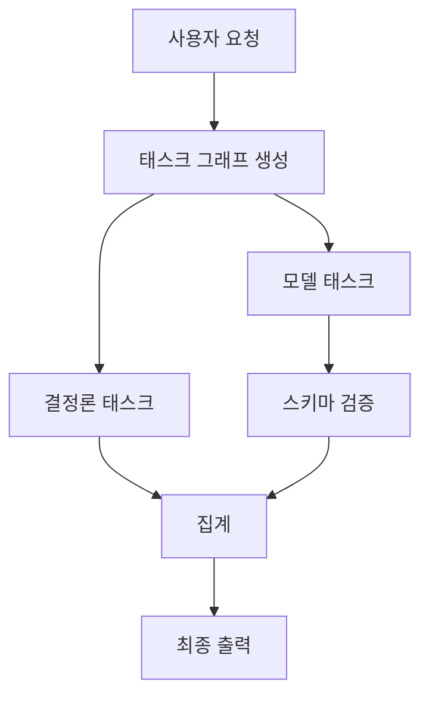
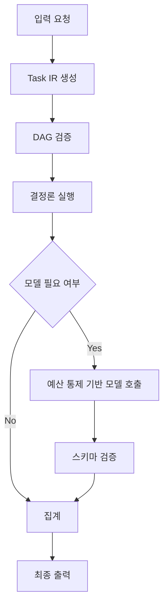

# [별첨 1] KORA 기술개요서

## 1. 문서 목적

본 문서는 KORA의 기술 개념, 구조, 핵심 구성요소, 정량 모델, 공개형 개발 방향을 별첨 형태로 정리한 기술개요서임.  
본 과제의 본문에서 제시한 개발 SW의 개요와 기술적 우수성을 보강하고, 평가위원이 KORA의 구조적 의미와 구현 범위를 보다 직관적으로 이해할 수 있도록 작성.

---

## 2. KORA의 정의

KORA는 대규모 언어모델(LLM) 기반 AI 시스템에서 발생하는 불필요한 모델 호출, 비용 증가, 지연시간 변동성, 출력 검증 한계를 해결하기 위한 **실행 제어 계층(Execution Control Layer)** 오픈소스 인프라 SW임.

기존 AI 시스템은 입력이 들어오면 곧바로 프롬프트를 구성하고 모델을 호출하는 단일 추론 구조를 기본으로 사용하는 경향 존재. 그러나 실제 요청 내부에는 조회, 규칙 적용, 형식 변환, 검증, 정렬과 같이 모델 없이 처리 가능한 결정론적 작업이 다수 포함. KORA는 이러한 작업을 먼저 분리하고, **결정론 처리 우선 / 선택적 추론 수행** 구조를 적용함으로써 AI 실행 구조를 통제 가능한 형태로 재구성하는 것을 목표로 함.

즉, KORA의 본질은 모델을 더 크게, 더 빠르게 실행하는 데 있지 않음.  
**모델 호출 이전 단계에서 실행 구조를 분해·판단·검증·계측하는 공통 계층을 제공하는 데 핵심 의미 존재.**

---

## 3. 개발 배경 및 문제 인식

### 3-1. 기존 구조의 한계

기존 AI 실행 구조는 대체로 다음 형태를 따름.


이 구조는 초기 구현은 단순하나, 다음 한계 존재.

- 요청 내부의 결정론 작업과 추론 작업 구분 부재
- 모든 요청이 동일한 고비용 추론 계층으로 전달
- 비용 선형 증가 구조
- 지연시간 변동성 및 꼬리 지연시간 확대
- 출력 구조 검증의 사후 처리 의존
- 실패 시 전체 요청 재처리 가능성 확대

### 3-2. 문제의 본질

문제는 모델 성능 부족이 아니라 **실행 구조의 부재**임.  
즉, “무엇을 먼저 모델 없이 처리할 수 있는지”를 판단하는 계층이 없기 때문에, 실제로는 추론이 필요하지 않은 작업까지 모두 모델 호출로 연결되는 구조적 비효율이 발생.

---

## 4. KORA의 핵심 개념

KORA는 요청을 하나의 프롬프트로 취급하지 않고, **태스크 중간표현(Task Intermediate Representation, 이하 ‘Task IR’)** 기반의 원자 태스크로 분해하여 실행.

각 태스크는 다음 속성을 가짐.

- 태스크 타입
- 입력
- 의존성
- 출력 스키마
- 예산 제약
- 라우팅 정보
- 메타데이터

이를 기반으로 요청은 **방향성 비순환 그래프(Directed Acyclic Graph, 이하 ‘DAG’)** 구조로 조립되며, 결정론 태스크는 CPU 중심으로 우선 실행되고, 모델 태스크는 예산 통제와 스키마 검증 하에서만 선택적으로 수행.

---

## 5. KORA 기본 구조

### 5-1. 기본 개념도



### 5-2. 구조적 의미

- 입력을 즉시 모델 호출로 연결하지 않음
- 요청을 여러 실행 단위로 분해
- 결정론 처리 가능한 작업을 우선 수행
- 추론은 필요한 경우에만 제한적으로 수행
- 출력은 검증 통과 후에만 집계
- 각 단계는 텔레메트리로 기록 가능

---

## 6. KORA의 핵심 기술 요소

### 6-1. 태스크 중간표현(Task IR) 기반 구조화

요청을 구조화된 실행 객체로 변환하는 방식.  
Task IR은 태스크의 의미, 경계, 제약 조건을 명시하며, 실행 이전 단계에서 통제 가능성을 확보하는 기반 역할 수행.

### 6-2. DAG 기반 의존성 검증

태스크 간 선후 관계를 DAG 형태로 정의하고, 순환 여부, 의존성 누락, 실행 순서를 사전에 검증하는 구조.  
잘못된 실행 구조를 실행 이전에 제거 가능.

### 6-3. 결정론 우선 실행

규칙 적용, 조회, 변환, 집계와 같이 모델 없이 처리 가능한 작업을 먼저 수행하는 실행 원칙.  
불필요한 모델 호출 감소, 비용 절감, 지연 안정화 효과 기대.

### 6-4. 예산 통제(Budget Governance)

모든 모델 태스크에 대해 최대 토큰 수(max_tokens), 최대 실행 시간(max_time_ms), 최대 재시도 횟수(max_retries)를 선언하고, 실행 전·중·후 단계에서 이를 강제하는 구조.

### 6-5. 스키마 검증(Schema Validation)

모델 출력이 명시된 JSON Schema를 통과한 경우에만 다음 단계로 전달되도록 하는 검증 구조.  
형식 불일치, 환각 기반 비정형 출력 확산을 억제하는 신뢰 경계 역할.

### 6-6. 텔레메트리(Telemetry) 기반 계측

태스크별 실행 시간, 모델 호출 수, 토큰 사용량, 재시도, 실패 유형, 라우팅 경로를 기록하여 구조적 효과를 계측 가능한 상태로 유지.

---

## 7. 실행 흐름



### 7-1. 단계 설명

- 입력 요청 수신
- Task IR 생성
- DAG 검증
- 결정론 태스크 우선 실행
- 미해결 태스크에 한해 모델 호출
- 스키마 검증
- 집계 후 최종 출력

---

## 8. 기존 구조 대비 차별성

| 구분 | 기존 단일 추론 구조 | KORA 구조 |
|---|---|---|
| 최소 실행 단위 | 프롬프트 | Task IR 기반 태스크 |
| 모델 호출 시점 | 즉시 호출 | 필요 시 선택 호출 |
| 결정론 작업 처리 | 추론 내부 혼합 | 별도 분리 후 우선 처리 |
| 출력 검증 | 사후 처리 중심 | 스키마 검증 기반 구조적 통제 |
| 실패 처리 | 전체 요청 단위 영향 | 태스크 단위 실패 격리 |
| 확장 구조 | 단일 모델 의존 | CPU·로컬 모델·원격 모델·분산 노드 연계 가능 |

---

## 9. 정량 모델

### 9-1. 비용 모델

KORA의 전체 실행 비용은 다음과 같이 모델링 가능.

\[
C_{total} = C_m(1-P)T + C_dPT + OT
\]

- \(C_m\): 모델 호출 비용
- \(C_d\): 결정론 처리 비용
- \(P\): 결정론 처리 비율
- \(O\): 구조 오버헤드
- \(T\): 전체 요청 수

### 9-2. 비용 절감 조건

\[
P(C_m - C_d) > O
\]

즉, 결정론 처리로 절감되는 비용이 구조 오버헤드를 초과하는 경우 전체 비용 절감 발생.

### 9-3. 지연시간 모델

\[
T_{total} = T_{construct} + T_{det} + T_{model} + T_{validation}
\]

- \(T_{construct}\): 태스크 그래프 생성 시간
- \(T_{det}\): 결정론 처리 시간
- \(T_{model}\): 모델 실행 시간
- \(T_{validation}\): 검증 및 집계 시간

### 9-4. 구조적 효과

- 결정론 처리 비율 증가 → 모델 호출 감소
- 모델 호출 감소 → 비용 감소
- 경로 분리 → 꼬리 지연시간 완화
- 태스크 단위 실행 → 병렬 처리 가능성 증가

---

## 10. 성능 비교 시각화(개념)

### 10-1. 결정론 처리 비율 대비 비용 변화
- x축: 결정론 처리 비율(P)
- y축: 총비용
- 기존 구조: 완만한 감소 또는 고정
- KORA 구조: 더 가파른 감소

### 10-2. 결정론 처리 비율 대비 평균 지연시간 변화
- x축: 결정론 처리 비율(P)
- y축: 평균 지연시간
- 기존 구조: 감소 폭 제한
- KORA 구조: 구조 오버헤드 이후 점진적 감소

---

## 11. 코드 구조 예시

아래는 KORA 런타임 구조 예시.

```text
kora/
├─ task_ir.py
├─ scheduler.py
├─ executor.py
├─ budget.py
├─ verification.py
└─ adapters/
   ├─ base.py
   ├─ openai_adapter.py
   └─ mock.py
```

### 11-1. 모듈 역할

- `task_ir.py` : 태스크와 태스크 그래프 구조 정의
- `scheduler.py` : DAG 검증, 순서 결정
- `executor.py` : 결정론 우선 실행, 모델 호출 조정
- `budget.py` : 예산 통제
- `verification.py` : 스키마 검증
- `adapters/` : 모델 연동 계층

---

## 12. Task IR 예시

```json
{
  "version": "1.0",
  "id": "task-001",
  "type": "model",
  "dependencies": ["task-000"],
  "input": {
    "query": "summarize this document"
  },
  "schema": {
    "type": "object",
    "properties": {
      "summary": { "type": "string" }
    },
    "required": ["summary"],
    "additionalProperties": false
  },
  "budget": {
    "max_tokens": 512,
    "max_time_ms": 2000,
    "max_retries": 2
  },
  "routing": {
    "preferred_backend": "local-small-model",
    "priority": "normal"
  },
  "metadata": {
    "trace_id": "req-123"
  }
}
```

---

## 13. 공개형 개발 현황

KORA는 신규 개념을 과제 기간 내 처음 설계하는 프로젝트가 아니라, 이미 GitHub 공개 저장소 기반으로 초기 릴리즈 수준의 구조 정리와 구현 검토를 병행 중인 프로젝트임.

현재 공개형 개발 흐름에서 진행 중인 내용은 다음과 같음.

- 실행 제어 계층 개념 정리
- Task IR 구조 정의
- 런타임 모듈 경계 설계
- 예산 통제 및 검증 구조 정리
- 공개 저장소 기반 문서화 진행
- 오픈소스 공개 준비 및 구조 검증 진행

---

## 14. 확장 방향

KORA는 오픈소스 프로젝트로 끝나는 구조가 아니라, 다음 확장 경로를 가짐.

### 14-1. OSS
핵심 실행 제어 계층 공개

### 14-2. KORA Studio
개인용 온디바이스 LLM 실행 앱  
개발자 및 개인 사용자의 로컬 실행 진입점 제공

### 14-3. KORA Cloud
관리형 실행 환경  
고동시성, 원격 추론, 상용 환경 확장

---

## 15. 기대효과

- 불필요한 모델 호출 감소
- 운영비용 절감
- 지연시간 안정화
- 출력 검증 가능성 향상
- 실패 격리 및 디버깅 효율 향상
- 공개형 AI 실행 구조 공통 자산 확보
- 국내 AI 오픈소스 생태계 기반 강화

---

## 16. 결론

KORA는 단순한 오케스트레이션 도구가 아니라, 모델 호출 이전 구조를 통제하는 **실행 제어 계층(Execution Control Layer)** 오픈소스 인프라 SW임.

기존 AI 시스템이 입력을 즉시 모델 호출로 연결하는 구조를 따르는 반면, KORA는 요청을 태스크 그래프로 분해하고, 결정론 처리와 선택적 추론, 예산 통제, 스키마 검증, 텔레메트리 계측을 하나의 실행 계약으로 통합함으로써 구조적 효율을 확보하는 것을 목표로 함.

즉, KORA의 핵심은 **AI를 더 크게 실행하는 것이 아니라, AI가 어떻게 실행되는지를 통제하는 구조를 제공하는 데 있음.**
