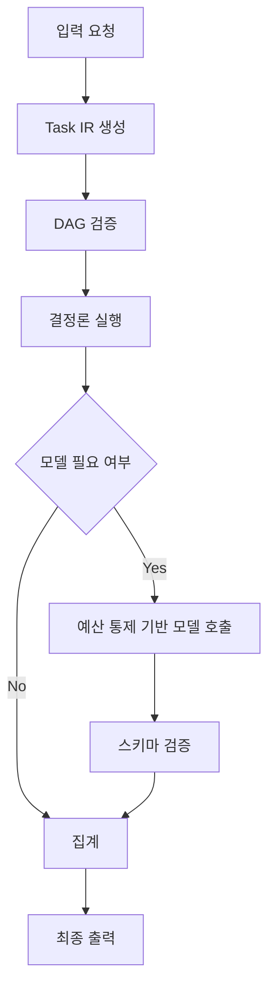
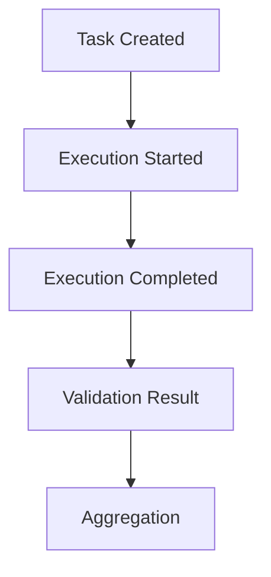

# [별첨 2] KORA 실행구조 및 정량모델 설명서

## 1. 문서 목적

본 문서는 KORA의 실행구조와 비용·지연 정량모델을 별첨 형태로 정리한 설명서임.  
과제 본문에서 제시한 개발 SW의 구조적 정의, 기술적 우수성, 성과지표의 근거를 보강하기 위한 자료로 활용.

---

## 2. KORA 실행구조 개요

KORA는 입력 요청을 즉시 모델 호출로 연결하지 않고, 태스크 중간표현(Task Intermediate Representation, 이하 'Task IR') 기반의 태스크 그래프로 변환한 뒤, 결정론 태스크와 모델 태스크를 분리하여 실행하는 구조.

핵심 실행 흐름은 다음과 같음.

1. 입력 요청 수신
2. Task IR 생성
3. 방향성 비순환 그래프(Directed Acyclic Graph, 이하 'DAG') 검증
4. 결정론 태스크 우선 실행
5. 필요 시에만 모델 태스크 호출
6. 스키마 검증
7. 집계 및 최종 출력

---

## 3. 실행 흐름도



---

## 4. 핵심 실행 원칙

### 4-1. 결정론 우선 실행
규칙 적용, 조회, 변환, 집계와 같이 모델 없이 처리 가능한 작업을 우선 수행하는 구조.

### 4-2. 선택적 추론 수행
모든 요청을 즉시 모델로 보내지 않고, 미해결 태스크에 한해서만 모델 호출을 수행하는 구조.

### 4-3. 예산 통제
모든 모델 태스크에 대해 최대 토큰 수(max_tokens), 최대 실행 시간(max_time_ms), 최대 재시도 횟수(max_retries)를 선언하고 이를 강제하는 방식.

### 4-4. 스키마 검증
모델 출력이 사전에 정의된 JSON Schema를 통과한 경우에만 다음 단계로 전달되도록 하는 구조.

### 4-5. 텔레메트리 계측
태스크별 실행시간, 모델 호출 수, 토큰 사용량, 재시도, 실패 유형을 기록하여 비용·지연·효과를 계측 가능한 상태로 유지하는 구조.

---

## 5. Task IR 예시

```json
{
  "version": "1.0",
  "id": "task-001",
  "type": "model",
  "dependencies": ["task-000"],
  "input": {
    "query": "summarize this document"
  },
  "schema": {
    "type": "object",
    "properties": {
      "summary": { "type": "string" }
    },
    "required": ["summary"],
    "additionalProperties": false
  },
  "budget": {
    "max_tokens": 512,
    "max_time_ms": 2000,
    "max_retries": 2
  },
  "routing": {
    "preferred_backend": "local-small-model",
    "priority": "normal"
  },
  "metadata": {
    "trace_id": "req-123"
  }
}
```

---

## 6. 정량모델

## 6-1. 비용 구조 모델

KORA의 전체 실행 비용은 아래와 같이 표현 가능.

\[
C_{total} = C_m(1-P)T + C_dPT + OT
\]

- \(C_m\): 모델 호출 비용
- \(C_d\): 결정론 처리 비용
- \(P\): 결정론 처리 비율
- \(O\): 구조 오버헤드
- \(T\): 전체 요청 수

### 해석
- 결정론 처리 비율이 높아질수록 모델 호출 비용 감소
- 구조 오버헤드가 일정 수준 이하일 경우 전체 비용 절감 가능
- 비용 절감 구조를 감각이 아니라 수식으로 설명 가능한 특징 보유

---

## 6-2. 비용 절감 조건

\[
P(C_m - C_d) > O
\]

### 해석
- 결정론 처리로 줄어드는 비용이 구조 오버헤드를 초과할 경우 비용 절감 발생
- KORA의 효과는 결정론 처리 비율과 구조 오버헤드의 관계에 따라 달라지는 측정 가능한 구조

---

## 6-3. 지연시간 모델

\[
T_{total} = T_{construct} + T_{det} + T_{model} + T_{validation}
\]

- \(T_{construct}\): 태스크 그래프 생성 시간
- \(T_{det}\): 결정론 처리 시간
- \(T_{model}\): 모델 실행 시간
- \(T_{validation}\): 검증 및 집계 시간

### 해석
- 모델 실행 시간을 전체 지연시간의 유일한 원인으로 보지 않음
- 생성, 실행, 검증 단계를 분리하여 지연시간 분석 가능
- 결정론 태스크 병렬 실행과 실패 격리를 통해 꼬리 지연시간 완화 가능

---

## 7. 구조적 효과

- 결정론 처리 비율 증가 → 모델 호출 감소
- 모델 호출 감소 → 비용 감소
- 실행 경로 분리 → 평균 지연시간 및 꼬리 지연시간 안정화
- 태스크 단위 실행 → 병렬 처리 가능성 증가
- 태스크 단위 실패 격리 → 전체 요청 재실행 부담 감소

---

## 8. 성능 측정 기준

KORA의 성능 측정은 동일 입력셋·동일 시나리오·동일 실행 환경을 기준으로 수행.

### 측정 항목
- 종단간 평균 지연시간
- 95퍼센타일 지연시간
- 스키마 검증 성공률
- 모델 호출 수
- 토큰 사용량
- 재시도 횟수
- 실패 유형

### 측정 원칙
- 공개 범위 기준으로 재현 가능해야 함
- 동일 조건 반복 측정 기반으로 결과 산출
- 최종 결과는 외부공인인증기관 시험으로 검증 예정

---

## 9. 텔레메트리 구조



### 기록 항목
- task_id
- task_type
- start_time
- end_time
- duration_ms
- model_used
- tokens_in
- tokens_out
- retries
- validation_status

---

## 10. 결론

KORA의 실행구조는 단순 모델 호출 최적화가 아니라, 모델 호출 이전 단계에서 요청을 구조화하고, 실행을 분해·통제·검증·계측하는 체계에 핵심 의미 존재.

즉, KORA의 정량모델은 비용·지연·실패를 감각이 아니라 측정 가능한 구조로 설명 가능하게 하며, 이는 본 과제의 기술적 타당성과 성과지표의 근거를 동시에 제공.

