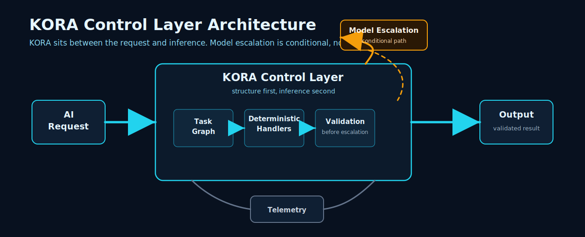

# KORA Documentation Index

## Purpose

This is the starting point for navigating KORA documentation.

KORA is an open-source execution-control layer that turns AI requests into structured execution paths before inference.

Most AI apps call the model too soon. KORA changes the default. Structure first. Inference second.

## Start

- [Main README](../README.md)
- [Current v0.3.0-alpha prerelease](https://github.com/Krako-Labs/KORA/releases/tag/v0.3.0-alpha)
- [KORA Category Thesis](vision/2026-05-06-kora-category-thesis.md)

## Understand



KORA control layer architecture.

- [KORA Claim Registry](claims/kora-claim-registry.md)
- [KORA Public Language Guide](claims/kora-public-language-guide.md)
- [Telemetry and observability counters](telemetry-and-observability.md#current-public-counters)
- [Testing and validation strategy](testing-and-validation-strategy.md)
- [Research agenda](research-agenda.md)
- [Whitepaper](whitepaper.md)

## KORA Studio Planning

KORA Studio is future planning only. It is not implemented yet.

- [KORA Studio overview](kora-studio/README.md)
- [KORA Studio v0.1 product spec](kora-studio/kora-studio-v0-1-product-spec.md)
- [KORA Studio MVP user flow](kora-studio/kora-studio-mvp-user-flow.md)
- [KORA Studio architecture](kora-studio/kora-studio-architecture.md)
- [KORA Boost copy system](kora-studio/kora-boost-copy-system.md)
- [KORA Studio UI composition](kora-studio/kora-studio-ui-composition.md)
- [KORA Studio implementation breakdown](kora-studio/kora-studio-implementation-breakdown.md)
- [KORA Studio report viewer requirements](kora-studio/report-viewer-requirements.md)
- [KORA Studio dashboard counter schema](kora-studio/dashboard-counter-schema.md)
- [KORA Studio fixtures plan](kora-studio/fixtures-plan.md)
- [KORA Studio fixture schema reference](kora-studio/fixture-schema-reference.md)
- CLI skeleton: `python3 -m kora studio`
- Local server skeleton: `python3 -m kora studio --serve`

## Run

- [Examples directory](../examples/)
- [Experiments regeneration guide](../experiments/README.md)
- [Benchmark real app guide](benchmark-real-app.md)
- [Benchmark overview](benchmark.md)
- [Customer-support triage workload spec](workloads/customer-support-triage.md)
- [Good first issue candidates](good_first_issues.md)

Local setup prerequisites:

- Packaged support is Python 3.11 or newer, as declared in `pyproject.toml`.
- Python 3.9.6 has been observed to run the offline `direct_vs_kora` example in one user environment.
- Treat Python 3.9.6 as a troubleshooting datapoint, not as the advertised package support floor until clean Python 3.9 compatibility testing is completed.
- KORA uses `pyproject.toml`-based packaging.
- Upgrade `pip`, `setuptools`, and `wheel` before editable install.
- VS Code's selected interpreter may differ from terminal `python3`; use the intended `.venv` in both places.

Clean local setup:

```bash
python3 --version

rm -rf .venv
python3 -m venv .venv
source .venv/bin/activate

python3 -m pip install --upgrade pip setuptools wheel
python3 -m pip install -e ".[dev]"

python3 -m kora run hello_kora -- --offline
python3 -m kora run direct_vs_kora -- --offline
```

Core local commands:

```bash
python3 -m kora --help
python3 -m kora examples list
python3 -m kora run customer_support_triage_fake_validation -- --offline
python3 -m kora run real_model_call_validation_fake -- --offline
python3 -m kora run direct_vs_kora -- --offline
python3 -m kora run runtime_integrated_benchmark -- --offline
```

A local `python3 -m kora examples list` run should include entries like these; your checkout may list additional examples:

```text
Runnable examples
- customer_support_triage_fake_validation: customer-support triage local no-network validation example (graph.json: no)
- direct_vs_kora: direct call vs KORA-controlled path (graph.json: yes)
- real_model_call_validation_fake: local no-network model-call validation example (graph.json: no)
- runtime_integrated_benchmark: initial runtime-path benchmark harness (graph.json: no)
```

Some example command names are compatibility-preserving. The local validation examples emit public-facing `local_validation` provider labels.
Use `--report-md /tmp/kora_validation.md` with local validation examples to generate reviewer-facing Markdown reports from aggregate counters.

Local setup troubleshooting:

- `TypeError: unsupported operand type(s) for |: 'ModelMetaclass' and 'ModelMetaclass'` usually indicates a local Python, virtual environment, `pip`, `setuptools`, or dependency compatibility problem. Recreate `.venv`, upgrade `pip setuptools wheel`, and reinstall with `python3 -m pip install -e ".[dev]"`.
- Editable install errors mentioning a missing `setup.py` or `setup.cfg` despite `pyproject.toml` existing usually indicate stale local build tooling. Upgrade `pip`, `setuptools`, and `wheel` inside the activated virtual environment.
- If VS Code fails while Terminal works, select the repository `.venv` interpreter in VS Code and confirm VS Code is using the same Python as your working terminal.

Useful diagnostics:

```bash
python3 --version
python3 -m pip --version
python3 -m pip show pydantic
which python3
```

## Inspect Evidence

Use this path for the current `v0.3.0-alpha` prerelease runtime evidence and regeneration flow:

1. Current workload: [`experiments/workloads/deterministic_heavy_v1_100.json`](../experiments/workloads/deterministic_heavy_v1_100.json)
2. Workload generator: [`experiments/generate_workload.py`](../experiments/generate_workload.py)
3. Benchmark runner: [`experiments/run_benchmark.py`](../experiments/run_benchmark.py)
4. Summary generator: [`experiments/summarize_benchmark_results.py`](../experiments/summarize_benchmark_results.py)
5. Runtime benchmark example: [`examples/runtime_integrated_benchmark`](../examples/runtime_integrated_benchmark)
6. Runtime evidence reviewer guide: [`docs/reports/v0.3.0-alpha-runtime-evidence-reviewer-guide.md`](reports/v0.3.0-alpha-runtime-evidence-reviewer-guide.md)
7. Artifact policy and regeneration commands: [`docs/reports/benchmark_artifact_policy.md`](reports/benchmark_artifact_policy.md)
8. Current benchmark summary: [`docs/benchmarks/kora_benchmark_result_v1_100.md`](benchmarks/kora_benchmark_result_v1_100.md)
9. Validation roadmap: [`docs/benchmarks/validation-roadmap.md`](benchmarks/validation-roadmap.md)
10. Real model-call validation design: [`docs/benchmarks/real-model-call-validation-design.md`](benchmarks/real-model-call-validation-design.md)
11. Real model-call validation report template: [`docs/benchmarks/real-model-call-validation-report-template.md`](benchmarks/real-model-call-validation-report-template.md)
12. Local validation reviewer packet: [`docs/benchmarks/local-validation-reviewer-packet.md`](benchmarks/local-validation-reviewer-packet.md)
13. Local model adapter design: [`docs/benchmarks/local-model-adapter-design.md`](benchmarks/local-model-adapter-design.md)
14. Real provider adapter design: [`docs/benchmarks/real-provider-adapter-design.md`](benchmarks/real-provider-adapter-design.md)
15. Real provider test harness design: [`docs/benchmarks/real-provider-test-harness-design.md`](benchmarks/real-provider-test-harness-design.md)
16. Local no-network model-call validation example: [`examples/real_model_call_validation_fake`](../examples/real_model_call_validation_fake)
17. Customer-support triage local validation example: [`examples/customer_support_triage_fake_validation`](../examples/customer_support_triage_fake_validation)
18. Customer-support triage workload spec: [`docs/workloads/customer-support-triage.md`](workloads/customer-support-triage.md)
19. Claim boundary source: [`docs/claims/kora-claim-registry.md`](claims/kora-claim-registry.md)

Current approved public claim:

> KORA reduced model invocations by 80% in a reproducible deterministic-heavy benchmark workload.

This evidence does not claim production cost reduction proof, real API-cost reduction proof, production benchmark proof, full runtime-integrated benchmark evidence, broad workload superiority proof, or energy reduction evidence.

Raw benchmark JSON artifacts are reproducible outputs and are not frozen or committed for this alpha release.

Additional evidence and release docs:

- [v0.3.0 runtime-integrated benchmark architecture](design/v0.3.0-runtime-integrated-benchmark-evidence-architecture.md)
- [v0.3.0-alpha release-readiness checklist](reports/v0.3.0-alpha-release-readiness-checklist.md)
- [v0.3.0-alpha docs and claim audit](reports/v0.3.0-alpha-docs-claim-audit.md)
- [v0.3.0-alpha release validation packet](reports/v0.3.0-alpha-release-validation-packet.md)
- [v0.3.0-alpha release approval checkpoint](reports/v0.3.0-alpha-release-approval-checkpoint.md)
- [v0.3.0-alpha post-release EOD report](eod/kora_eod_2026_05_07_v0.3.0-alpha_release.md)
- [v0.3.0-alpha post-release cleanup plan](reports/v0.3.0-alpha-post-release-cleanup-plan.md)
- [v0.3.1-alpha roadmap](planning/v0.3.1-alpha-roadmap.md)

## Paper Preparation

- [KORA first paper draft v0](paper/kora-first-paper-draft-v0.md)
- [KORA first paper manuscript v0.1](paper/kora-first-paper-manuscript-v0-1.md)
- [KORA first paper outline](paper/kora-first-paper-outline.md)
- [KORA first paper evidence summary](paper/kora-first-paper-evidence-summary.md)
- [KORA first paper figures and tables](paper/kora-first-paper-figures-and-tables.md)
- [KORA first paper figure specifications](paper/kora-first-paper-figure-specs.md)
- [KORA first paper table specifications](paper/kora-first-paper-table-specs.md)
- [KORA first paper related work map](paper/kora-first-paper-related-work-map.md)
- [KORA first paper reference plan](paper/kora-first-paper-reference-plan.md)
- [KORA first paper reference tracker](paper/kora-first-paper-reference-tracker.md)
- [KORA first paper bibliography notes](paper/kora-first-paper-bibliography-notes.md)
- [KORA first paper submission readiness](paper/kora-first-paper-submission-readiness.md)
- [KORA first paper claim boundary](paper/kora-first-paper-claim-boundary.md)
- [KORA first paper missing evidence checklist](paper/kora-first-paper-missing-evidence-checklist.md)
- [KORA first paper section status](paper/kora-first-paper-section-status.md)
- [KORA first paper reviewer questions](paper/kora-first-paper-reviewer-questions.md)
- [KORA first paper manuscript review checklist](paper/kora-first-paper-manuscript-review-checklist.md)

## Help Test

- [Help Test KORA](community/help-test-kora.md)
- [Contact and discussion routes](community/contact-and-discussion-routes.md)
- [Contributor pathway](community/contributor-pathway.md)
- [Workload proposal template](community/workload-proposal-template.md)
- [KORA validation roadmap](benchmarks/validation-roadmap.md)
- [KORA social media announcement guide](community/KORA_SOCIAL_MEDIA_ANNOUNCEMENT_GUIDE.md)
- [KORA community manager guide](community/KORA_COMMUNITY_MANAGER_GUIDE.md)

Good candidate workloads:

- customer-support triage
- repetitive RAG workflows
- agent workflows with budget or escalation rules
- deterministic-heavy backend workflows
- LLM apps with high repeated request patterns

## Contribute

- [Canonical governance document](../GOVERNANCE.md)
- [Contributing guide](../CONTRIBUTING.md)
- [Branch and PR workflow](../CONTRIBUTING.md#branch-and-pr-workflow)
- [Bug report template](../.github/ISSUE_TEMPLATE/bug_report.md)
- [Contact and discussion routes](community/contact-and-discussion-routes.md)
- [Contributor pathway](community/contributor-pathway.md)
- [Good first issue candidates](community/good-first-issue-candidates.md)
- [Workload proposal template](community/workload-proposal-template.md)
- [Security policy](../SECURITY.md)
- [Code of conduct](../CODE_OF_CONDUCT.md)
- [KORA open roles](community/2026-05-06-kora-open-roles.md)
- [AI-assisted contribution guide](community/2026-05-06-ai-assisted-contribution-guide.md)
- [Community sync issue template](community/2026-05-06-community-sync-issue-template.md)
- [KORA OSS Operating System](ops/2026-05-06-kora-oss-operating-system.md)
- [KORA GitHub Platform Setup Plan](ops/2026-05-06-kora-github-platform-setup-plan.md)
- [Discussions and Wiki plan](ops/2026-05-06-kora-discussions-and-wiki-plan.md)
- [Label taxonomy](ops/2026-05-06-kora-label-taxonomy.md)

## Maintainers And Operators

- [KORA OSS Operating System](ops/2026-05-06-kora-oss-operating-system.md)
- [Manual GitHub setup checklist](ops/2026-05-06-kora-manual-github-setup-checklist.md)
- [Repository hygiene audit](ops/2026-05-06-kora-repository-hygiene-audit.md)

## Public Documentation Boundary Note

Public KORA documentation should read as normal open-source project documentation.

Do not place private credentials, personal data, unpublished partner notes, or internal operating material in public docs.

## Evidence Preservation Note

Older reports, EOD documents, benchmark summaries, and migration docs may look historical, but they should not be deleted casually. They preserve release, benchmark, paper, EIC/grant, investor, and operating evidence.

Use the [repository hygiene audit](ops/2026-05-06-kora-repository-hygiene-audit.md) before any cleanup.
