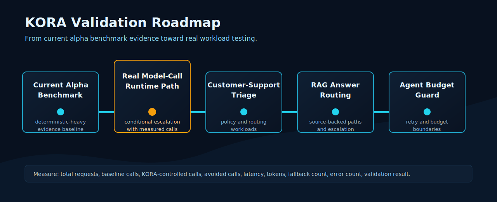

# KORA Validation Roadmap

## Purpose

This document defines the public validation path for KORA after the `v0.3.0-alpha` release.

KORA's message is simple:

Most AI apps call the model too soon. KORA changes the default. Structure first. Inference second.

The validation roadmap turns that message into measurable evidence. Each target below is designed to test whether KORA can reduce unnecessary model invocation while preserving useful outputs, validation results, and runtime telemetry.

## Current Alpha Evidence

The current approved public claim is:

> KORA reduced model invocations by 80% in a reproducible deterministic-heavy benchmark workload.

This result is based on the current deterministic-heavy alpha benchmark. It should not be interpreted as production cost reduction proof, real API-cost reduction proof, production benchmark proof, broad workload superiority proof, or energy reduction evidence.

## Next Validation Targets

The next validation targets move from deterministic-heavy alpha evidence toward runtime-integrated and workload-specific evidence:

1. Runtime-integrated benchmark paths with real model calls
2. Customer-support triage workloads
3. RAG answer-routing workloads
4. Agent budget-guard workloads

## Target 1: Runtime-integrated benchmark paths with real model calls

Purpose:

Test KORA-controlled execution against a baseline that uses real model calls under a documented runtime path.

Example workload:

A mixed set of deterministic requests, simple classification requests, and model-required reasoning requests executed with a real model provider in a controlled environment.

Counters to measure:

- total requests
- baseline model calls
- KORA-controlled model calls
- avoided model calls
- latency
- token usage where applicable
- estimated or measured cost where applicable
- fallback count
- error count
- validation result

What claim could become possible after validation:

KORA may be able to say: "KORA reduced measured model invocations by X% in a runtime-integrated benchmark using real model calls."

What still cannot be claimed:

This would still not prove universal production cost reduction, broad workload superiority, energy reduction, or production validation.

## Target 2: Customer-support triage workloads

Purpose:

Test whether repetitive support requests can be routed through deterministic classification, policy checks, and escalation rules before model use.

Example workload:

Support tickets that include password reset requests, order-status questions, refund-policy questions, account-risk cases, and ambiguous cases requiring model escalation.

Counters to measure:

- total requests
- baseline model calls
- KORA-controlled model calls
- avoided model calls
- latency
- token usage where applicable
- estimated or measured cost where applicable
- fallback count
- error count
- validation result

What claim could become possible after validation:

KORA may be able to report measured model-call reduction for a documented customer-support triage workload.

What still cannot be claimed:

This would not prove results across all customer-support systems, all ticket distributions, production cost reduction, or customer satisfaction improvement.

## Target 3: RAG answer-routing workloads

Purpose:

Test whether retrieval confidence, deterministic rules, and validation can decide when an answer can be returned, when it should be refused, and when a model call is needed.

Example workload:

Repeated internal knowledge-base questions where some answers are exact-match retrieval, some require synthesis, and some should be escalated or rejected because source evidence is missing.

Counters to measure:

- total requests
- baseline model calls
- KORA-controlled model calls
- avoided model calls
- latency
- token usage where applicable
- estimated or measured cost where applicable
- fallback count
- error count
- validation result

What claim could become possible after validation:

KORA may be able to report measured model-call reduction and answer-routing outcomes for a documented RAG workload.

What still cannot be claimed:

This would not prove answer quality superiority, universal hallucination reduction, production cost reduction, or broad RAG workload superiority.

## Target 4: Agent budget-guard workloads

Purpose:

Test whether KORA can enforce execution budgets, retry boundaries, and escalation rules around agent-like workflows.

Example workload:

Agent workflows that include deterministic preprocessing, tool selection, retry limits, model escalation rules, and budget stops for repeated or low-value requests.

Counters to measure:

- total requests
- baseline model calls
- KORA-controlled model calls
- avoided model calls
- latency
- token usage where applicable
- estimated or measured cost where applicable
- fallback count
- error count
- validation result

What claim could become possible after validation:

KORA may be able to report measured model-call reduction and budget-rule enforcement for a documented agent workload.

What still cannot be claimed:

This would not prove general agent reliability, universal cost savings, production performance, or broad workload superiority.

## What We Will Measure

Every validation target should record:

- total requests
- baseline model calls
- KORA-controlled model calls
- avoided model calls
- latency
- token usage where applicable
- estimated or measured cost where applicable
- fallback count
- error count
- validation result

Where possible, validation should also record workload distribution, model/provider configuration, prompt templates, deterministic rules, escalation rules, and telemetry event counts.

## Claim Upgrade Path

Current approved public claim:

> KORA reduced model invocations by 80% in a reproducible deterministic-heavy benchmark workload.

Future conditional claim after runtime-integrated real model-call validation:

> KORA reduced measured model invocations by X% in a runtime-integrated benchmark using real model calls.

That future claim is not approved as a current claim. It requires merged evidence, documented methodology, validation commands, reviewed results, and claim-registry approval.

## Non-Claims

Do not claim:

- KORA reduces production AI costs by 80%.
- KORA reduces real API costs by 80%.
- KORA reduces energy consumption by 80%.
- KORA proves broad workload superiority.
- KORA is validated in production.
- KORA guarantees cost reduction.
- KORA is formally government validated.
- KORA has signed partner validation unless actually signed and documented.

## How To Help

We are looking for early developers and AI app teams who want to test KORA against real workloads.

Good starting points:

- [Help Test KORA](../community/help-test-kora.md)
- [Runtime evidence reviewer guide](../reports/v0.3.0-alpha-runtime-evidence-reviewer-guide.md)
- [Claim registry](../claims/kora-claim-registry.md)

Open a GitHub Discussion or contact the project maintainers with a sanitized workload description. Do not share secrets, API keys, private user data, or proprietary datasets in public channels.

TODO: Add the canonical GitHub Discussions URL and maintainer contact route once they are finalized.
