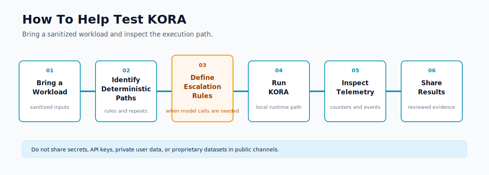

# Help Test KORA

## Who This Is For

This page is for developers and AI app teams who suspect their system calls the model too soon.

KORA is especially relevant if your workload has repeated requests, deterministic branches, validation rules, escalation rules, or budget limits that should be enforced before inference.

## Current Alpha Evidence

Current approved public claim:

> KORA reduced model invocations by 80% in a reproducible deterministic-heavy benchmark workload.

This is alpha benchmark evidence. It is not production cost reduction proof, real API-cost reduction proof, production benchmark proof, broad workload superiority proof, or energy reduction evidence.

## What We Want To Test Next

KORA's next validation targets are:

1. Runtime-integrated benchmark paths with real model calls
2. Customer-support triage workloads
3. RAG answer-routing workloads
4. Agent budget-guard workloads

The goal is to measure when structure, deterministic execution, validation, and telemetry can reduce unnecessary model invocation without hiding errors or weakening output checks.



How to help test KORA with a real workload.

## Good Candidate Workloads

- customer-support triage
- repetitive RAG workflows
- agent workflows with budget or escalation rules
- deterministic-heavy backend workflows
- LLM apps with high repeated request patterns

See the [customer-support triage workload spec](../workloads/customer-support-triage.md) for a synthetic example of deterministic-first routing and conditional model escalation.

Good candidates usually have at least one of these properties:

- some requests can be classified without a model
- some responses follow strict templates or rules
- some cases should escalate only after validation fails
- some workflows need token, retry, or latency budgets
- repeated requests make direct model-first execution wasteful or hard to inspect

## Workload Submission Template

Use this template for early discussion. Keep it sanitized.

For where to propose workloads or ask questions, see [Contact and Discussion Routes](contact-and-discussion-routes.md).

```text
Workload type:

Current model/API used:

Approximate request volume:

Which requests are repetitive or deterministic?

What should trigger model escalation?

Do you have sample inputs/outputs?

Can results be shared publicly?

Contact:
```

Do not include secrets, API keys, private user data, proprietary datasets, private credentials, or confidential customer information.

Private or sanitized workloads are acceptable for early discussion. Public benchmark claims require reviewed evidence and explicit approval before publication.

## How To Participate

1. Clone the repo.
2. Run the alpha locally.
3. Inspect the execution path and telemetry.
4. Prepare a sanitized workload description using the template above.
5. Follow the current route in [Contact and Discussion Routes](contact-and-discussion-routes.md).

## What Not To Expect Yet

KORA is still alpha software.

Do not expect:

- production cost reduction proof
- real API-cost reduction proof
- production benchmark proof
- broad workload superiority proof
- energy reduction evidence
- formal government validation
- signed partner validation unless actually signed and documented
- guaranteed adoption, funding, or support commitments
