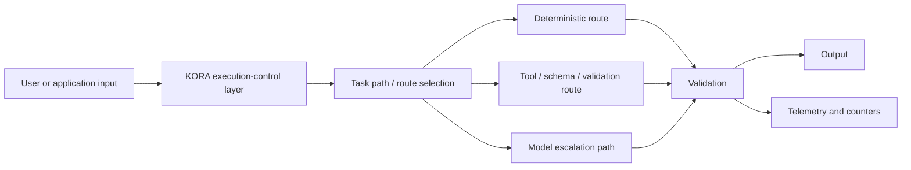
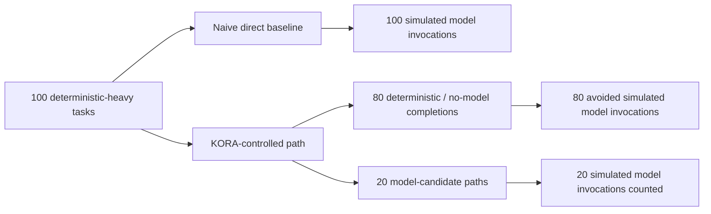

# KORA First Paper Figure, Table, and Algorithm Drafts v0.1

Status date: 2026-05-13

## Purpose

This document drafts text-based paper assets for manuscript v0.4 review: figures, tables, pseudocode, captions, and appendix inventory material. It does not create binary assets, does not add new benchmark numbers, and does not mark the paper as submission-ready.

## Figure 1: KORA Execution-Control Architecture

Suggested insertion: Section 3, KORA Execution Model.



Caption: KORA inserts an execution-control layer before inference. Deterministic, structured, and validation routes are attempted when sufficient; model escalation remains available when deterministic handling is not sufficient. The figure describes architecture only and does not claim production readiness.

Insertion note: Use as a rendered figure or keep as a text/flowchart appendix item depending on final export route.

## Figure 2: Direct Baseline vs KORA-Controlled Benchmark Flow

Suggested insertion: Section 4, Evaluation Methodology, or Section 5.1, Deterministic-heavy benchmark.



Caption: The deterministic-heavy benchmark compares a naive direct baseline with KORA-controlled execution. The direct baseline counts 100 simulated model invocations. KORA-controlled execution records 20 simulated model invocations and 80 avoided simulated model invocations, for an 80% avoided invocation rate in this workload. This does not imply real API calls, production traffic, cost savings, or energy reduction.

Insertion note: Keep "simulated model invocations" in labels and caption.

## Table 1: Deterministic-Heavy Benchmark Result Summary

Suggested insertion: Section 5.1, Deterministic-heavy benchmark.

| Metric | Value | Scope note |
|---|---:|---|
| Total tasks | 100 | Deterministic-heavy benchmark workload |
| Deterministic/no-model tasks | 80 | Established workload metadata |
| Fallback/model-candidate tasks | 20 | Established workload metadata |
| Direct-baseline simulated model invocations | 100 | Baseline counts one simulated invocation per task |
| KORA-controlled simulated model invocations | 20 | KORA-controlled path counts model-candidate paths |
| Avoided simulated model invocations | 80 | Baseline count minus KORA-controlled count |
| Avoided invocation rate | 80% | `80 / 100` |
| Deterministic outputs checked | 80 | Established benchmark metadata |
| Mismatches | 0 | Established benchmark metadata |
| Fallback/model-candidate skipped | 20 | Established benchmark metadata |

Caption: Deterministic-heavy benchmark counters for the current reproducible 100-task workload. Values are simulated model-invocation counters and deterministic output checks; they are not production, real API-cost, latency, or energy measurements.

## Table 2: Evidence Boundary / Non-Claim Table

Suggested insertion: Section 6, Limitations, or near the Results interpretation.

| Statement | Status in current paper | Evidence basis |
|---|---|---|
| Reproducible deterministic-heavy benchmark | Supported | Tracked workload, benchmark commands, and reviewer-safe docs |
| Simulated model invocation reduction | Supported for current workload | 100 direct-baseline simulated invocations vs 20 KORA-controlled simulated invocations |
| Deterministic output checks | Supported for deterministic subset | 80 deterministic outputs checked with 0 mismatches |
| Synthetic local/no-network validation | Supported as local validation only | Customer-support triage fake validation example |
| Production API cost reduction | Not claimed | No production traffic, provider billing, or cost methodology in current evidence |
| Real provider benchmark | Not claimed | Offline/local evidence only in current paper scope |
| Energy reduction | Not claimed | No energy measurement methodology or result |
| Broad workload superiority | Not claimed | Evidence is limited to documented workloads |
| Formal artifact approval | Not claimed | No formal artifact evaluation has occurred |

Caption: Evidence boundary table for the first KORA paper. The supported claims are limited to documented benchmark and local/no-network validation evidence; stronger production, cost, energy, broad-superiority, and formal-approval claims are out of scope.

## Algorithm 1: Deterministic-First Routing Pseudocode

Suggested insertion: Section 3, KORA Execution Model.

```text
Algorithm 1: Deterministic-first routing

Input:
  tasks: structured task requests
  routes: deterministic, structured, policy, and model-candidate routes

Output:
  outputs, validation results, telemetry counters

for each task in tasks:
    path = select_task_path(task, routes)

    if deterministic_or_structured_route_is_sufficient(path, task):
        candidate_output = run_deterministic_or_structured_route(path, task)
        validation_result = validate_output(candidate_output, task)

        if validation_result.accepted:
            record_telemetry(task, route="deterministic_or_structured")
            emit(candidate_output)
            continue

    model_candidate = prepare_model_candidate_path(task, path)
    candidate_output = run_or_count_model_candidate(model_candidate)
    validation_result = validate_output(candidate_output, task)
    record_telemetry(task, route="model_candidate")
    emit(candidate_output)
```

Caption: Conceptual pseudocode for deterministic-first routing. KORA attempts deterministic or structured handling before model-candidate escalation, validates route outputs, and records telemetry. This is a paper-level abstraction and not an implementation guarantee for every route class.

## Appendix Table: Artifact and Reproducibility Inventory

Suggested insertion: appendix or reproducibility section.

| Artifact role | Repository path | Package status |
|---|---|---|
| Manuscript draft | `docs/paper/kora-first-paper-manuscript-v0-4.md` | Current submission-candidate draft, not final |
| Figure/table/algorithm plan | `docs/paper/kora-first-paper-figure-table-algorithm-plan-v0-1.md` | Created for human review |
| Figure/table/algorithm drafts | `docs/paper/kora-first-paper-figure-table-algorithm-drafts-v0-1.md` | Created for human review |
| Workload generator | `experiments/generate_workload.py` | Tracked source |
| Canonical deterministic-heavy workload | `experiments/workloads/deterministic_heavy_v1_100.json` | Tracked workload |
| Benchmark runner | `experiments/run_benchmark.py` | Tracked source |
| Benchmark summary generator | `experiments/summarize_benchmark_results.py` | Tracked source |
| Runtime benchmark example | `examples/runtime_integrated_benchmark/run.py` | Tracked source |
| Runtime benchmark report script | `examples/runtime_integrated_benchmark/report.py` | Tracked source |
| Reproduction transcript checklist | `docs/paper/kora-first-paper-reproduction-transcript-checklist-v0-1.md` | Checklist exists; final transcript pending |
| Artifact package inventory | `docs/paper/kora-first-paper-artifact-package-inventory-v0-1.md` | Inventory exists; final package pending |
| Benchmark artifact policy | `docs/reports/benchmark_artifact_policy.md` | Tracked policy |
| Runtime evidence reviewer guide | `docs/reports/v0.3.0-alpha-runtime-evidence-reviewer-guide.md` | Tracked reviewer guide |

Caption: Repository artifact and reproducibility inventory for the first KORA paper package. The table identifies tracked source and documentation paths; it does not include raw generated benchmark artifacts and does not claim formal artifact approval.

## Human Review Items

- Decide whether Mermaid diagrams should be rendered into final PDF figures or converted to venue/export-specific graphics later.
- Decide whether Table 1 replaces or augments the current Section 5.1 table.
- Decide whether Table 2 belongs in the main text or limitations section.
- Decide whether Algorithm 1 belongs in the main text or appendix.
- Decide whether the appendix artifact table should be shortened for arXiv export.
- Confirm figure/table/algorithm numbering after final export format is selected.

## Status

The draft assets are ready for human review. Manuscript v0.4 was not edited in this pass. The paper remains not submission-ready.
